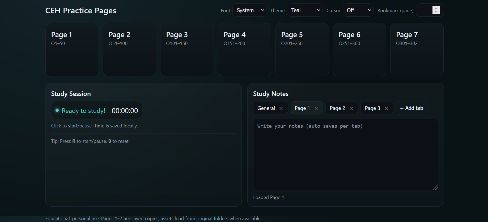

# CEH Practice Pages

**Why this exists:** I turned a messy set of ExamTopics snapshots into a polished study companion so I could revise CEH content *and* exercise frontend/DevOps skills (theming, timers, GitHub Pages deployment, CI link scanning).

## Live Demo
- https://haziqachik.github.io/ceh-pages/ — main dashboard with theme switcher, timer, bookmarking, tabbed notes
- https://haziqachik.github.io/ceh-pages/pages/study/index.html — study index with question ranges and quick links

## Screenshot

## Release & Evidence
- [Release v1.4](https://github.com/haziqachik/ceh-pages/releases/tag/v1.4)
- [UAT Sign-off](UAT-SIGNOFF.md)
- [Analysis & Plans](docs/analysis/)
- [Reports & Diffs](docs/reports/)
- [Learning Notes](docs/learning-notes.md)
- [Changelog](CHANGELOG.md)

## Repository Structure
- index.html - landing page with navigation grid, theme selector, timer, and tabbed notes
- pages/study/1.html … pages/study/7.html - lightweight redirect stubs that jump into each saved ExamTopics page
- pages/study/index.html - curated overview + quick navigation
- pages/snapshots/examtopics/page-0N.html - full ExamTopics HTML snapshots (kept intact for offline study)
- ssets/img/pages/ & ssets/img/examtopics/ - normalized CSS/JS/media assets shared across study snapshots
- pdfs/CEH_1.pdf … pdfs/CEH_7.pdf - companion PDF exports for quick reference
- downloads/ceh-examtopics-export.zip - original ExamTopics archive (raw source download)
- .github/workflows/pages.yml & .github/workflows/link-check.yml - deployment + link-check CI

## Features
- Theme and font switcher with 10+ palettes to keep long sessions fresh
- Bookmark field that highlights the last page visited
- Cursor trails (off, dot, comet) for a little flair
- Study timer with start/pause/reset and status colours, persisted to local storage
- Tabbed notes with add/rename/delete, auto-saved per tab in local storage

## Setup
1. Clone or download the repository: git clone https://github.com/haziqachik/ceh-pages.git
2. Optionally unzip downloads/ceh-examtopics-export.zip if you want the raw export alongside the curated files.
3. Serve the folder or open index.html directly:
   - Quick static server: 
px serve .
   - Or open index.html in a browser (all links point to local files, so no network dependency).

## Usage
- Launch index.html to view the page grid; clicking a card opens the saved ExamTopics page (pages/study/1.html - pages/study/7.html).
- Use the [study index](pages/study/index.html) for an overview of question ranges and quick navigation.
- Pick a theme/font combo, toggle the cursor effect, and start the session timer when you begin studying.
- Use the notes tabs to capture takeaways per topic; they persist automatically in the browser.

## Accessibility Checklist
- [x] Keyboard navigation reaches all interactive elements
- [x] Visible focus states for links/buttons (tested in light + dark themes)
- [x] Color contrast checked for primary body text vs. background
- [ ] Run Lighthouse accessibility audits periodically (see [	ools/lighthouse.md](tools/lighthouse.md))

## Development
- Install dependencies: 
pm install
- Format key files: 
pm run format
- Helpful scripts and audit notes live under [	ools/](tools/README.md)

## Notes
- Content is saved for personal, educational use only. Please do not redistribute.
- The site relies on localStorage; browsers that block it (e.g., Safari Private Browsing) will disable saving but the pages still load.
- For history of UI tweaks, check CHANGELOG.md.

## What I Practiced
- Frontend: reorganizing raw HTML snapshots, building a themed UI, localStorage patterns
- DevOps: Git branching, GitHub Pages deployment, CI link scanning
- Documentation & UAT: written evidence (UAT sign-off, changelog, reports, learning notes)

## Roadmap
- [ ] Add Lighthouse/a11y audit script under 	ools/
- [ ] Automate link-map regeneration for new snapshots
- [ ] Review accessibility labels/contrast on the study dashboard